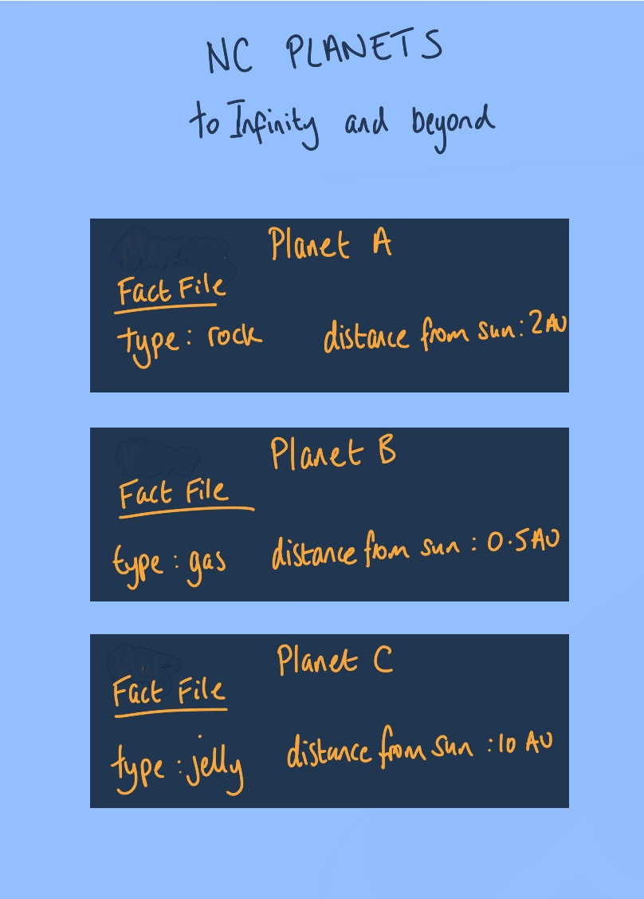

# React Project Reresher

Your task is to build an app which lists information on the planets in our solar system.🪐

## Pre lecture Tasks:

1. Use the following wireframe to plan your app. Consider what components you'll want to build. Where might be want to house this state. Sketch out a component tree diagram to help illustrate your decisions. Think of where we could make of a resuable component.



2. Using your plan, build up your individual components. You can use the following fake data to populate your app.

```js
[
  {
    planet_id: 1,
    planet_name: "planet a",
    au_from_sun: "1",
    type: "gas",
    moon_count: "0",
  },
  {
    planet_id: 2,
    planet_name: "planet b",
    au_from_sun: "2",
    type: "rock",
    moon_count: "4",
  },
];
```

You do not need to worry about the styling right now, just ensure you are able _hydrate_ your components with the data provided.

NASA are fickle over their definition of a planet, so we should not assume that we will always have same number of planets. The planet data may update, where can we store it in our app to ensure those changes update our components?

**Further Task**

3.  Think about how you might choose to represent the data. Presenting information to a user as `label:value` like depicted in the wireframe is not very inspiring. Think about how you present the data for each planet with the card. This [article](https://www.refactoringui.com/previews/labels-are-a-last-resort) is a very good read on how to refactor the UI.

## Post Lecture Tasks

1. Time to remove your hard coded data! We want to fetch the most up to date planets every time we load open the app. Make use of the [Fetch API](https://developer.mozilla.org/en-US/docs/Web/API/Fetch_API) to request this data and update state with the up to date planets.

- What value(s) wil need to exist in the dependency array? Why?

2. Data fetches may take some time! Make use of the the is loading pattern to let the user know that something is happening whilst they await for the data.

3. Data fetches are common in applications. There's a danger that the logic will bloat our components and maybe be useable elsewhere. Extract out the data fetch logic to a separate file to tidy up our project a bit.
